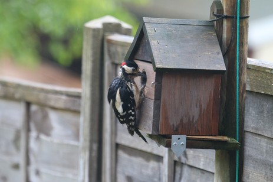
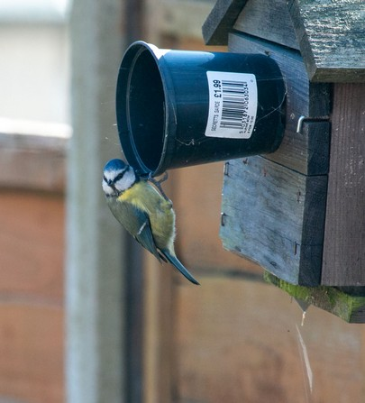
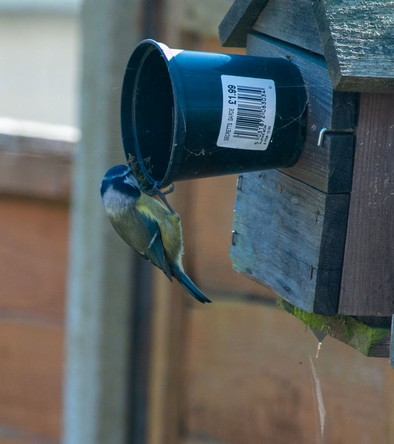
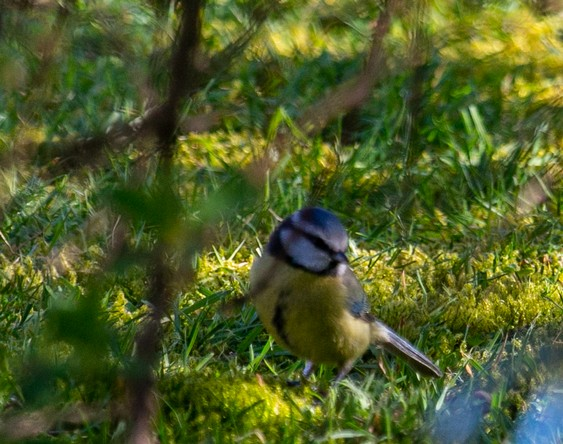
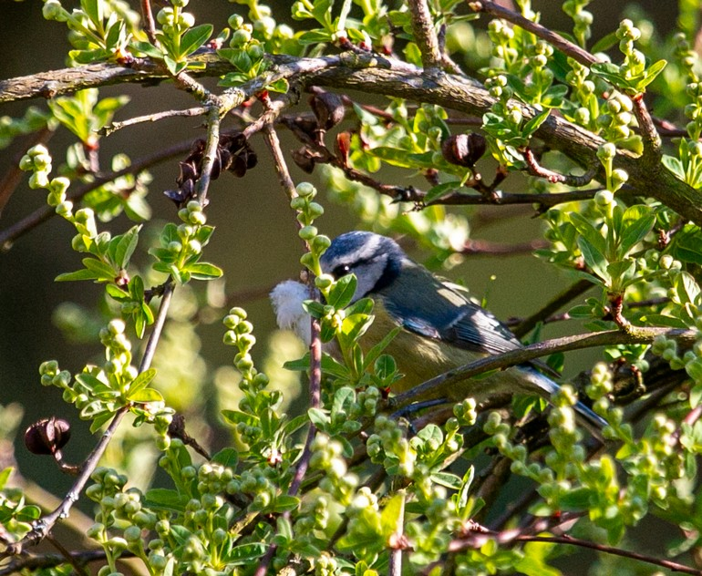

2021 will be the fourth year running we will have had Bluetits nesting in a nest box with a camera that is attached to a wooden pole some 15 feet from our house, allowing easy unobstructed viewing either via the camera feed inside the box or directly out the house window.

For the previous 2 years we have been battling a lesser spotted woodpecker, nicknamed 'woody' who has been intent on breakfasting on bluetit chicks!

Finally, last spring, but not before we had already lost several chicks, I found a solution that worked, attaching a flower pot to the entrance of the nest box that prevented woody getting his beak into the box to hook out a chick.

So hoping this year the entire brood will stand a fighting chance, not withstanding any other natural hazards they encounter in their young lives.

We have had a pair of birds showing an interest in the box for the last 6 weeks or so, (possibly one of last years hatchlings?). [See video at link](https://www.youtube.com/watch?v=k-Bee5Dkm8A).

They have been filling the box with nesting material one minute, and removing it the next, they seem very indecisive! The femail (so I am reliably informed by an expert in such things) has been sleeping in the box overnight.  [See video at link](https://www.youtube.com/watch?v=j882UhPAFsg)

